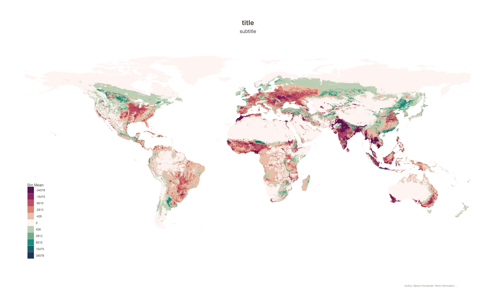

```{r setup, include=FALSE}
knitr::opts_chunk$set(echo = TRUE)
```

## A Sustainability Index based on Agricultural Production

<center>

</center>

We present changs in agricultural production under different climate scenarios for different future periods, if farmers keep harvesting the same crops as today. 
Moreover the spatial resolution allows to draw conclusions within national and subnational regions. Agricultural Changes dependent on the 


